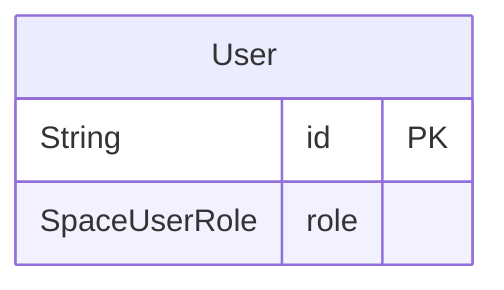

# ZModel

> Generated by [`ZenStack-markdown`]((https://github.com/jiashengguo/zenstack-markdown))

- [User](#User)

## User

```mermaid
erDiagram
"User" {
  String id PK 
  SpaceUserRole role  
}

```
- CREATE

- READ

- UPDATE

- DELETE
